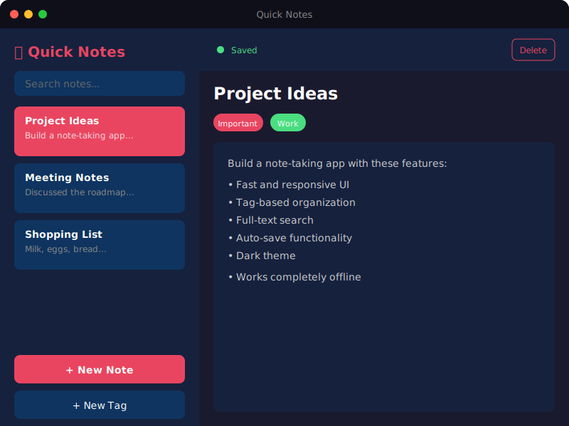

# Quick Notes

<p align="center">
  
</p>

<p align="center">
  A fast, modern desktop note-taking application built with Electron, React, and TypeScript.
</p>

<p align="center">
  <a href="https://github.com/priyanshuchawda/electron-notes/releases"></a>
  <a href="LICENSE"></a>
  <a href="https://github.com/priyanshuchawda/electron-notes/actions"></a>
</p>

<p align="center">
  <a href="https://priyanshuchawda.github.io/electron-notes/">Website</a> •
  <a href="https://github.com/priyanshuchawda/electron-notes/releases">Download</a> •
  <a href="#features">Features</a> •
  <a href="#tech-stack">Tech Stack</a>
</p>

---

## 🚀 Download

| Version | Description | Download |
|---------|-------------|----------|
| **Installer** | Recommended - includes uninstaller | [Quick Notes Setup 1.0.0.exe](https://github.com/priyanshuchawda/electron-notes/releases/download/v1.0.0/Quick.Notes.Setup.1.0.0.exe) |
| **Portable** | No installation needed | [Quick Notes-1.0.0-Portable.exe](https://github.com/priyanshuchawda/electron-notes/releases/download/v1.0.0/Quick.Notes-1.0.0-Portable.exe) |

## ✨ Features

- 📝 **Create and manage notes** - Simple, distraction-free note-taking
- 🏷️ **Tag system** - Organize notes with colorful tags
- 🔍 **Full-text search** - Quickly find any note
- 💾 **Auto-save** - Notes are automatically saved as you type
- 🌙 **Dark theme** - Easy on the eyes
- 🔒 **100% Offline** - Your data stays on your computer
- ⚡ **Lightning fast** - Built with performance in mind

## 🛠️ Tech Stack

| Category | Technologies |
|----------|-------------|
| **Frontend** | React 18, TypeScript, Vite |
| **Desktop** | Electron 28 |
| **Backend** | Bun, Elysia (strictly typed routes) |
| **Database** | SQLite (sql.js) with optimized indexes |
| **State** | TanStack Query (React Query) |
| **Build** | electron-builder, GitHub Actions |

### Code Quality
- ✅ **Strictly typed** - No `any` or `ts-ignore` anywhere
- ✅ **Type-safe API routes** - Using Elysia's typed routes
- ✅ **Optimized queries** - Proper database indexing for fast reads/writes

## 📁 Project Structure

```
electron-notes/
├── .github/workflows/      # CI/CD (auto-deploy website, auto-build releases)
├── docs/                   # Landing page website (GitHub Pages)
├── packages/
│   ├── desktop/           # Electron + React app
│   │   ├── src/main/      # Electron main process + SQLite
│   │   └── src/renderer/  # React frontend
│   ├── server/            # Bun + Elysia API (for development)
│   └── shared/            # Shared TypeScript types
├── package.json           # Monorepo workspace
└── tsconfig.base.json     # Shared TypeScript config
```

## 🏃 Development

### Prerequisites
- [Bun](https://bun.sh/) >= 1.0
- [Node.js](https://nodejs.org/) >= 18

### Setup

```bash
# Clone the repository
git clone https://github.com/priyanshuchawda/electron-notes.git
cd electron-notes

# Install dependencies
bun install

# Start development (desktop app with hot reload)
bun run dev:desktop
```

### Build

```bash
# Build for Windows (creates installer + portable)
cd packages/desktop
bun run dist
```

Output will be in `packages/desktop/release/`

## 📡 API Endpoints (Development Server)

| Method | Endpoint | Description |
|--------|----------|-------------|
| GET | `/health` | Health check |
| GET | `/notes` | List notes (with search & pagination) |
| GET | `/notes/:id` | Get single note |
| POST | `/notes` | Create note |
| PUT | `/notes/:id` | Update note |
| DELETE | `/notes/:id` | Delete note |
| GET | `/tags` | List tags |
| POST | `/tags` | Create tag |
| DELETE | `/tags/:id` | Delete tag |

## 🗑️ Uninstalling

**Installer version:**
1. Open Windows Settings → Apps
2. Find "Quick Notes" → Uninstall
3. Choose whether to keep or delete your notes data

**Portable version:**
- Just delete the `.exe` file
- Notes data is stored in `%APPDATA%\Quick Notes\`

## 📄 License

MIT License - see [LICENSE](LICENSE) for details.

## 👤 Author

**Priyanshu Chawda**
- GitHub: [@priyanshuchawda](https://github.com/priyanshuchawda)

---

<p align="center">
  Made with ❤️ using Electron, React, and TypeScript
</p>
